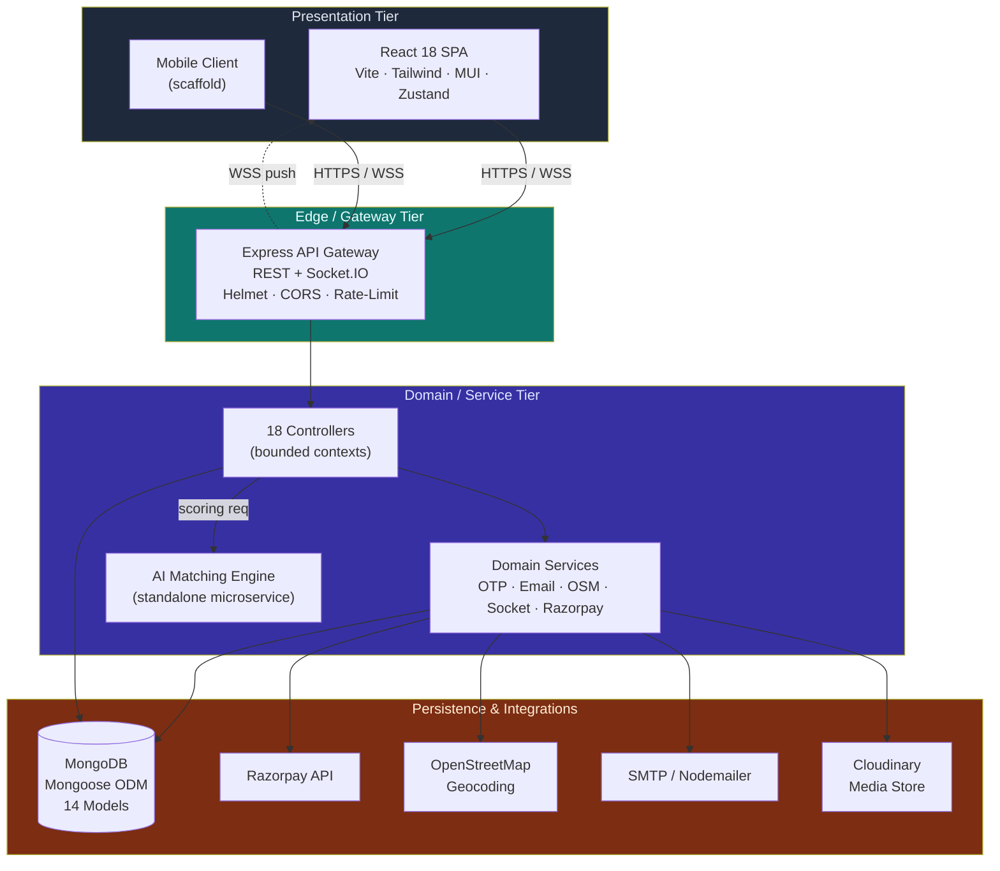
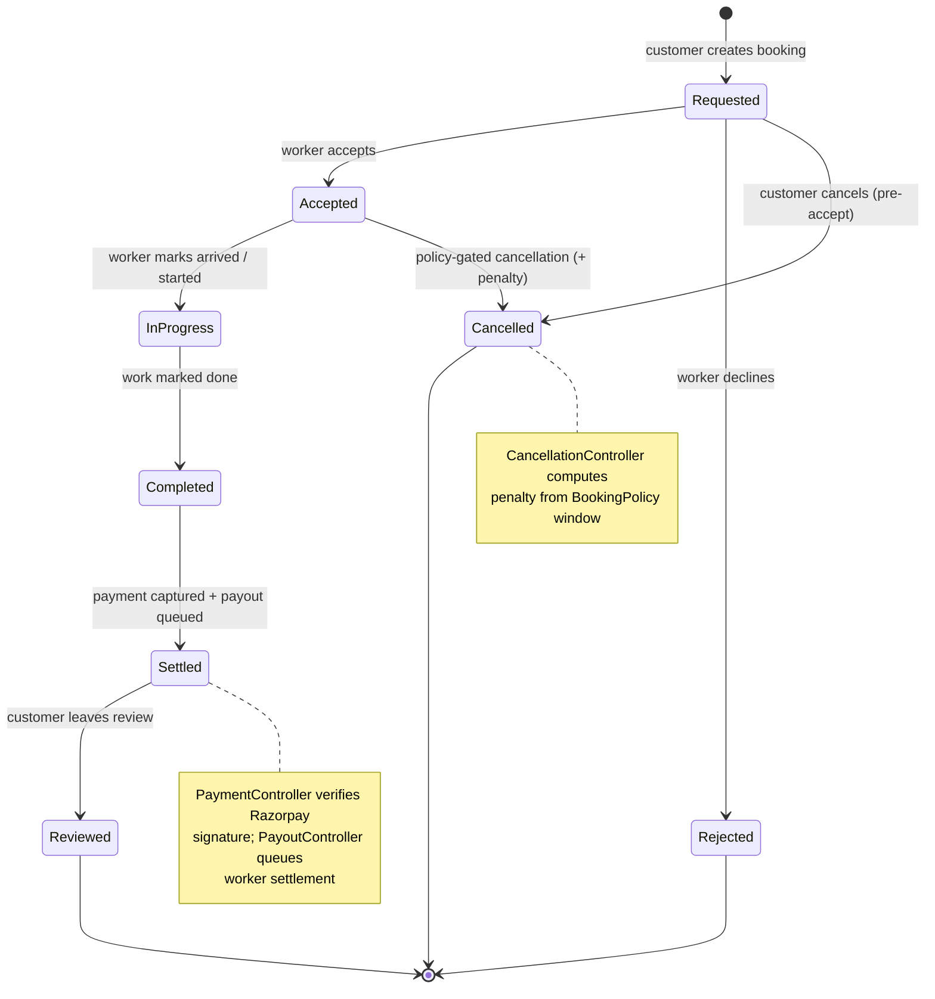
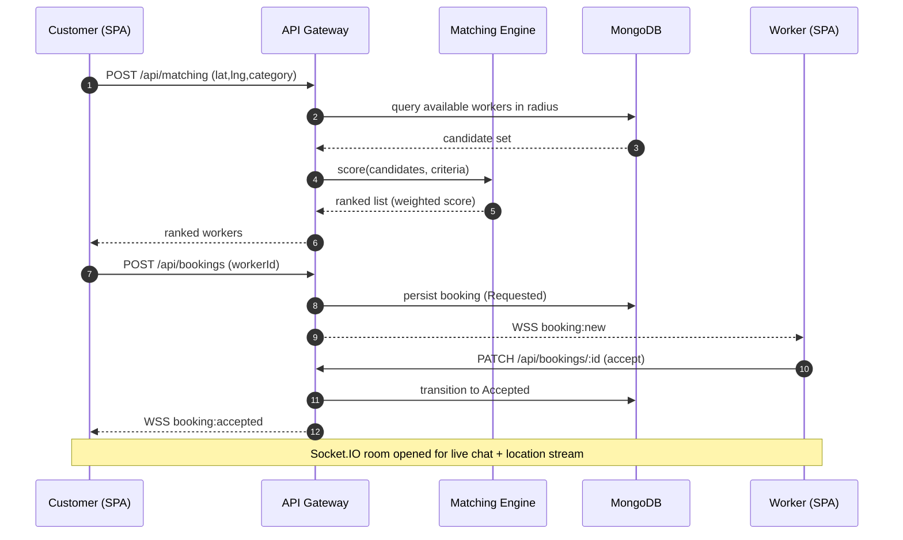
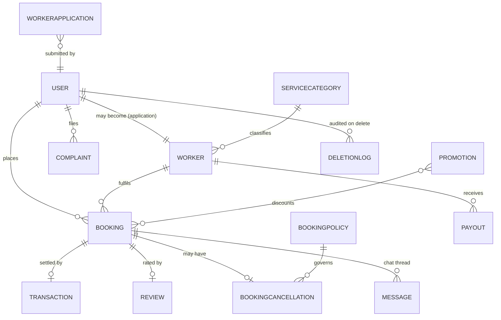
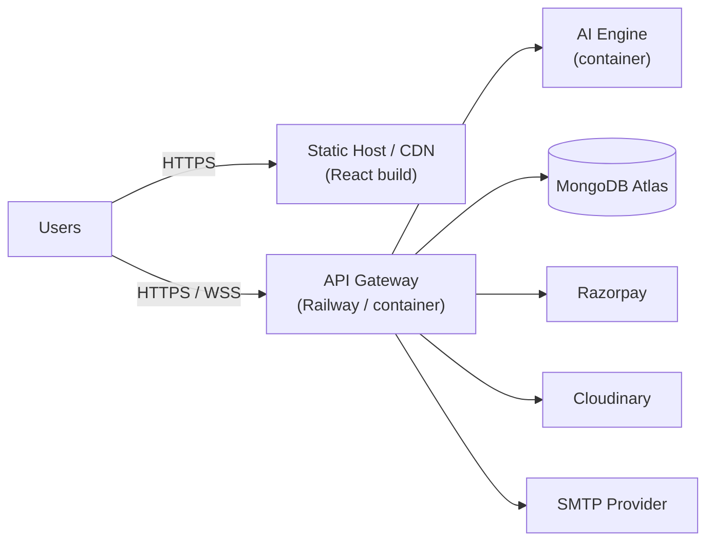

<div align="center">

# 🛠️ UdhyogaPay

### An On-Demand Blue-Collar Services Marketplace with Real-Time Geospatial Matching, Escrow-Style Payments, and an AI-Assisted Worker Recommendation Engine

[](https://www.typescriptlang.org/)
[](https://nodejs.org/)
[](https://react.dev/)
[](https://www.mongodb.com/)
[](https://socket.io/)
[](https://razorpay.com/)

*A production-oriented, service-decomposed platform connecting customers with verified blue-collar professionals — plumbers, electricians, carpenters, and more — through location-aware discovery, stateful booking lifecycles, and a real-time bidirectional event bus.*

</div>

---

## 📖 Table of Contents

1. [Overview](#-overview)
2. [Core Capabilities](#-core-capabilities)
3. [System Architecture](#-system-architecture)
4. [Booking Lifecycle State Machine](#-booking-lifecycle-state-machine)
5. [Real-Time Event Flow](#-real-time-event-flow)
6. [Data Model & Entity Relationships](#-data-model--entity-relationships)
7. [Module Catalogue (20+ Modules)](#-module-catalogue-20-modules)
8. [Technology Stack](#-technology-stack)
9. [Security Architecture](#-security-architecture)
10. [Repository Layout](#-repository-layout)
11. [Local Development Setup](#-local-development-setup)
12. [Environment Configuration](#-environment-configuration)
13. [API Surface](#-api-surface)
14. [Deployment Topology](#-deployment-topology)
15. [Roadmap](#-roadmap)
16. [Contributors](#-contributors)

---

## 🎯 Overview

**UdhyogaPay** is a multi-service, TypeScript-first marketplace that orchestrates the end-to-end journey between service **seekers** (customers) and service **providers** (workers). The platform is decomposed into four independently deployable runtimes — a **REST + WebSocket API gateway**, a **single-page React client**, a **standalone AI matching microservice**, and a **mobile client scaffold** — communicating over well-defined HTTP and Socket.IO contracts.

Rather than a monolithic CRUD app, UdhyogaPay models the domain as a set of **bounded contexts** — identity, discovery, booking, settlement, moderation, and analytics — each backed by dedicated controllers, services, and persistence models. The result is a system with clear separation of concerns, testable service boundaries, and a horizontally scalable real-time layer.

---

## ⚡ Core Capabilities

| Domain | Capability |
|--------|-----------|
| **Identity & Access** | JWT-based stateless auth, role-based access control (RBAC) across `user` / `worker` / `admin`, OTP verification, password reset flows |
| **Discovery** | Geospatial worker search using OpenStreetMap (OSM) geocoding, proximity ranking, category filtering |
| **AI Matching** | Weighted multi-factor scoring engine (proximity, rating, availability, price fit) exposed as a standalone microservice |
| **Booking** | Full lifecycle state machine with policy-driven cancellation windows and penalty computation |
| **Payments** | Razorpay order creation, signature verification, escrow-style hold-and-release, worker payouts |
| **Real-Time** | Socket.IO rooms for live chat, booking status pushes, worker location streaming, presence tracking |
| **Moderation** | Complaint intake, review & rating aggregation, admin adjudication, account deletion with audit logging |
| **Growth** | Promotions / coupon engine, executive analytics dashboards, reporting |

---

## 🏗️ System Architecture

A four-tier, service-decomposed topology. The API gateway is the single source of truth for state; the AI engine is a stateless scoring sidecar; the clients are thin, reactive presentation layers.



### Architectural Principles

- **Service decomposition** — the AI matching engine runs as an independent Node process so scoring load never contends with the transactional API.
- **Stateless gateway** — JWT auth means the API layer holds no session state and can scale horizontally behind a load balancer.
- **Event-driven real-time layer** — Socket.IO rooms decouple presence, chat, and location streams from the request/response path.
- **Repository via ODM** — Mongoose schemas encapsulate validation, indexing, and virtuals, keeping controllers thin.

---

## 🔄 Booking Lifecycle State Machine

The booking aggregate is governed by an explicit finite-state machine. Transitions are policy-gated (`BookingPolicy`) and every terminal transition emits a Socket.IO event and, where relevant, a settlement or payout side-effect.



---

## 📡 Real-Time Event Flow

A representative sequence: a customer books, the matching engine ranks candidates, the chosen worker accepts, and both parties receive live updates over WebSockets.



---

## 🗃️ Data Model & Entity Relationships

Fourteen Mongoose models form the persistence backbone. Core relationships:



| Model | Responsibility |
|-------|----------------|
| `User` | Identity, roles, profile, geolocation |
| `Worker` | Provider profile, skills, availability, rating aggregate |
| `WorkerApplication` | Onboarding & verification workflow |
| `Booking` | Core booking aggregate + FSM state |
| `BookingPolicy` | Cancellation windows, penalty rules |
| `BookingCancellation` | Cancellation record + computed penalty |
| `Transaction` | Payment ledger entry |
| `Payout` | Worker settlement record |
| `Promotion` | Coupon / discount definition |
| `Review` | Rating + textual feedback |
| `Complaint` | Moderation intake |
| `Message` | Chat message (Socket.IO backed) |
| `ServiceCategory` | Taxonomy of offered services |
| `DeletionLog` | Deletion audit trail |

---

## 🧩 Module Catalogue (20+ Modules)

### Backend Domain Modules (Controllers → Services → Models → Routes)

| # | Module | Description |
|---|--------|-------------|
| 1 | **Auth** | Registration, login, JWT issuance, password reset |
| 2 | **User** | Profile management, geolocation, preferences |
| 3 | **Worker** | Provider profiles, availability, skill sets |
| 4 | **Worker Application** | Onboarding, document upload, verification gating |
| 5 | **Matching** | Candidate discovery + AI scoring orchestration |
| 6 | **Booking** | Lifecycle FSM, create / accept / progress / complete |
| 7 | **Booking Policy** | Cancellation-window & penalty configuration |
| 8 | **Cancellation** | Policy-gated cancellation + penalty computation |
| 9 | **Payment** | Razorpay order creation & signature verification |
| 10 | **Payout** | Worker settlement queue & disbursement |
| 11 | **Promotion** | Coupon / discount engine |
| 12 | **Review** | Rating capture & aggregate recomputation |
| 13 | **Complaint** | Moderation intake & lifecycle |
| 14 | **Chat** | Persisted messaging over Socket.IO |
| 15 | **Service Category** | Service taxonomy CRUD |
| 16 | **Admin** | Administrative operations & oversight |
| 17 | **Report** | Analytics & operational reporting |
| 18 | **Account Deletion** | Right-to-erasure with audit logging |

### Cross-Cutting Service Modules

| # | Module | Description |
|---|--------|-------------|
| 19 | **AI Matching Service** | Weighted multi-factor scoring (`aiMatchingService`) |
| 20 | **OSM Service** | Geocoding & reverse-geocoding via OpenStreetMap |
| 21 | **OTP Service** | One-time-password generation & validation |
| 22 | **Email Service** | Transactional email via Nodemailer/SMTP |
| 23 | **Socket Service** | Real-time room & presence management |
| 24 | **Razorpay Service** | Payment gateway integration wrapper |

### Frontend Feature Modules

| # | Module | Description |
|---|--------|-------------|
| 25 | **Design System** | Reusable primitives — Button, Card, Modal, KPICard, Charts, CommandPalette |
| 26 | **Auth Flows** | Login, Register, ResetPassword |
| 27 | **User Workspace** | Dashboard, Home discovery, Profile, live map |
| 28 | **Worker Workspace** | Onboarding, Dashboard, Pending-approval, Profile |
| 29 | **Admin Console** | Executive dashboard, Payouts, Reviews, Complaints, Promotions, Reports, Policy config |
| 30 | **Map Layer** | Leaflet + React-Leaflet interactive geospatial UI |
| 31 | **Realtime Context** | Socket, Notification, Map, Auth, Toast React contexts |
| 32 | **Custom Hooks** | 15+ hooks — `useGeolocation`, `useLocationTracking`, `useSocket`, `useDebounce`, `usePagination`, … |

> **30+ discrete modules** across four runtimes — comfortably exceeding the 20-module threshold, and each is a real, wired-up unit of the codebase.

---

## 🧪 Technology Stack

### Backend (`udhyogapay-backend`)
`TypeScript` · `Node.js` · `Express` · `Mongoose/MongoDB` · `Socket.IO` · `JWT (jsonwebtoken)` · `bcrypt` · `Joi` (validation) · `Helmet` · `express-rate-limit` · `CORS` · `Razorpay` · `Nodemailer` · `Cloudinary` · `Multer` · `cookie-parser` · `uuid`

### Frontend (`udhyogapay-frontend`)
`React 18` · `TypeScript` · `Vite` · `React Router` · `Tailwind CSS` · `MUI` + `MUI X Data Grid` · `Zustand` (state) · `React Hook Form` + `Zod` (schema validation) · `Framer Motion` · `Leaflet` / `React-Leaflet` · `Socket.IO Client` · `Axios` · `React Hot Toast` · `Lucide` / `React Icons`

### AI Engine (`ai-matching-engine`)
`TypeScript` · `Node.js` — standalone scoring microservice

### Mobile (`udhyogapay-mobile`)
Cross-platform client scaffold

---

## 🔐 Security Architecture

- **Stateless JWT auth** with signed tokens; `auth` middleware verifies on every protected route.
- **Role-Based Access Control** via `roleCheck` middleware enforcing `user` / `worker` / `admin` boundaries.
- **Payment integrity** — Razorpay callback **signature verification** prevents forged settlement.
- **Transport & header hardening** — `Helmet` security headers, configurable `CORS` allow-list.
- **Abuse mitigation** — `express-rate-limit` on sensitive endpoints (auth, OTP).
- **Input validation** — `Joi` (server) and `Zod` (client) schemas at both trust boundaries.
- **Secrets hygiene** — all credentials injected via environment variables; `.env.example` templates provided per service.
- **Auditable erasure** — account deletion writes a `DeletionLog` record for compliance traceability.

---

## 📂 Repository Layout

```
UDHYOGAPAY/
├── backend/                 # Express + Socket.IO API gateway (TypeScript)
│   └── src/
│       ├── config/          # DB, env, third-party client config
│       ├── controllers/     # 18 domain controllers
│       ├── middleware/      # auth, roleCheck, upload
│       ├── models/          # 14 Mongoose schemas
│       ├── routes/          # 18 route modules
│       ├── services/        # aiMatching, email, osm, otp, razorpay, socket
│       ├── scripts/         # admin bootstrap & maintenance utilities
│       └── utils/           # shared helpers
├── frontend/                # React 18 + Vite SPA (TypeScript)
│   └── src/
│       ├── components/       # common, design-system, map, user
│       ├── context/          # Auth, Socket, Map, Notification, Toast
│       ├── hooks/            # 15+ custom hooks
│       ├── pages/            # Auth, User, Worker, Admin
│       ├── services/         # typed API clients (17 modules)
│       ├── types/            # shared TS types
│       └── utils/
├── ai_engine/               # Standalone AI matching microservice
├── mobile/                  # Mobile client scaffold
├── shared/                  # Cross-runtime shared code
└── docs/*.md                # Deployment, payment, env & technical guides
```

---

## 🚀 Local Development Setup

### Prerequisites
- Node.js ≥ 18
- MongoDB (local or Atlas connection string)
- Razorpay test keys, SMTP credentials, Cloudinary account (for full feature parity)

### 1. Clone
```bash
git clone https://github.com/9059Rohith/UDHYOGAPAY.git
cd UDHYOGAPAY
```

### 2. Backend
```bash
cd backend
npm install
cp .env.example .env        # then fill in secrets
npm run dev                 # starts API + Socket.IO
```

### 3. Frontend
```bash
cd frontend
npm install
cp .env.example .env
npm run dev                 # Vite dev server
```

### 4. AI Engine
```bash
cd ai_engine
npm install
npm run dev
```

---

## ⚙️ Environment Configuration

Each service ships a `.env.example`. Key variables:

| Service | Variables |
|---------|-----------|
| Backend | `MONGODB_URI`, `JWT_SECRET`, `RAZORPAY_KEY_ID`, `RAZORPAY_KEY_SECRET`, `SMTP_*`, `CLOUDINARY_*`, `CLIENT_URL` |
| Frontend | `VITE_API_URL`, `VITE_SOCKET_URL`, `VITE_RAZORPAY_KEY_ID` |
| AI Engine | `PORT`, service-specific scoring weights |

See [`ENV_SETUP_GUIDE.md`](./ENV_SETUP_GUIDE.md) and [`PAYMENT_INTEGRATION_GUIDE.md`](./PAYMENT_INTEGRATION_GUIDE.md) for full detail.

---

## 🔌 API Surface

The gateway exposes 18 route groups under `/api`:

```
/api/auth                 /api/users             /api/workers
/api/worker-applications  /api/matching          /api/bookings
/api/booking-policies     /api/cancellations     /api/payments
/api/payouts              /api/promotions        /api/reviews
/api/complaints           /api/chat              /api/service-categories
/api/reports              /api/admin             /api/account-deletion
```

Real-time channels are served over the same origin via Socket.IO (booking events, chat, presence, location streaming).

---

## 🌐 Deployment Topology



Deployment guides: [`RAILWAY_DEPLOYMENT.md`](./RAILWAY_DEPLOYMENT.md), [`DEPLOYMENT_GUIDE.md`](./DEPLOYMENT_GUIDE.md).

---

## 🗺️ Roadmap

- [ ] Redis-backed Socket.IO adapter for multi-node horizontal scaling
- [ ] Replace in-memory scoring with a persisted feature store for the AI engine
- [ ] Push notifications (FCM/APNs) for the mobile client
- [ ] Observability: structured logging, metrics, distributed tracing
- [ ] Automated E2E test suite (Playwright) + CI pipeline

---

## 👤 Contributors

- **[9059Rohith](https://github.com/9059Rohith)** — Rohith Kumar Dhamagatla

---

<div align="center">

**UdhyogaPay** — engineering dignified work, one booking at a time.

</div>
